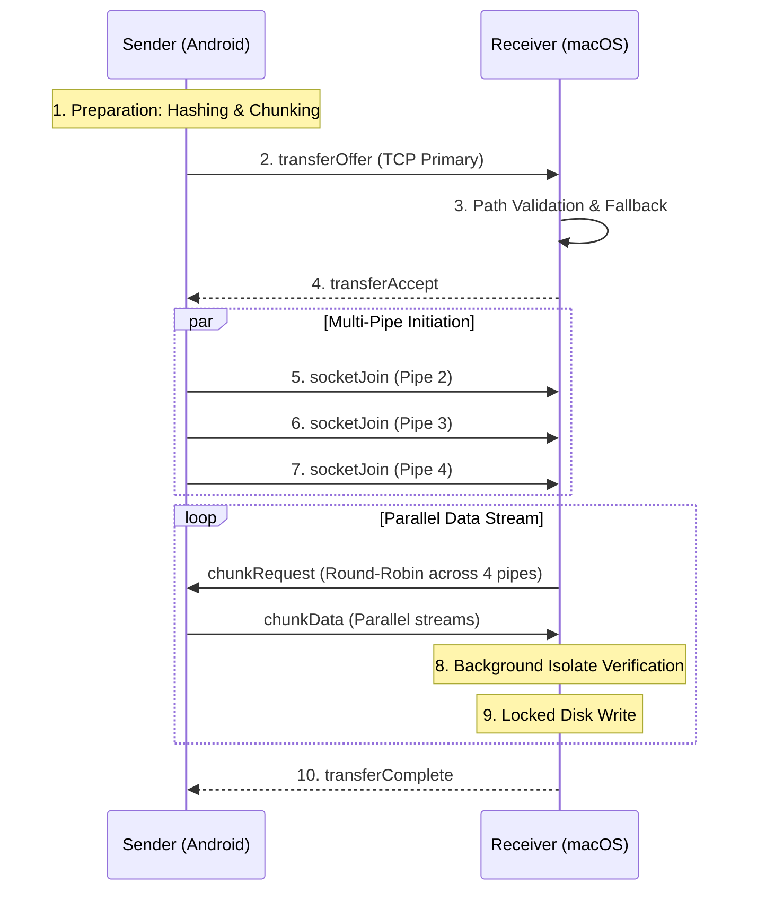

# RootDrop: High-Performance P2P Development Guide

RootDrop is a premium, cross-platform P2P file sharing application built with Flutter. It is designed for maximum throughput using a multi-socket parallel architecture, optimized specifically for macOS and Android.

## 🔄 Transfer Flow Sequence

---

## 🏗️ System Architecture

### 1. Discovery Layer (UDP)
Uses UDP broadcast and multicast for peer detection.
- **Protocol**: Custom JSON-based discovery packets.
- **Interface Binding**: On macOS, the service explicitly binds to the physical WiFi interface to bypass sandbox multicast restrictions.
- **Port**: Fixed discovery port `41234`.

### 2. Transport Layer (Multi-Socket TCP)
The core engine uses a "Multi-Pipe" strategy to saturate high-speed WiFi links.
- **Parallelism**: Every file transfer opens **4 simultaneous TCP connections**.
- **Load Balancing**: The Receiver distributes chunk requests across all available pipes using a round-robin scheduler.
- **Backpressure**: Optimized for 24 "in-flight" chunks to ensure no idle time between network packets.

### 3. Chunking Engine
Files are never loaded fully into memory. They are treated as indexed streams.
- **Chunk Size**: 1MB (Standard) or 2MB (High Speed).
- **Hashing**: SHA256 integrity checks are performed for every chunk.
- **Isolate Offloading**: Hashing is performed in **Background Isolates** to prevent UI stutter and maximize network throughput.

### 4. Storage & Sandbox Management
Designed to handle strict macOS and Android 13+ permission models.
- **Atomic Writes**: Uses `RandomAccessFile` with asynchronous write-locking to prevent data corruption.
- **Smart Fallback Tiers**:
  1. User-Selected Custom Path (e.g., Desktop).
  2. Public Downloads Folder.
  3. Documents Directory.
  4. **Internal App Support** (The "Nuclear Fallback" that cannot fail).

---

## 🎨 UI/UX Design

### 1. Modern Glassmorphism
The UI uses a dark-themed, premium aesthetic with subtle gradients and micro-animations.
- **Primary Color**: High-contrast Indigo/Light Blue.
- **Surface**: Translucent cards with divider lines for a clean, brutalist feel.

### 2. Live Transfer Feedback
Transfer cards provide high-fidelity status updates:
- **Preparing State**: Shows an hourglass icon and a separate progress bar while the file is being hashed (Isolate-bound).
- **Active State**: Displays real-time speed in MB/s and total progress.
- **Success State**: Prints the absolute storage path directly in the logs for easy retrieval.

---

## 🛠️ Development Workflow

### Running Locally
1. **macOS**: Entitlements are pre-configured to disable the App Sandbox for development, allowing full disk access.
2. **Android**: Permissions include `MANAGE_EXTERNAL_STORAGE` for public Downloads folder access.

### Performance Tuning
- **Parallel Pipes**: Modify `SenderSession.parallelPipes` to increase the number of TCP streams.
- **Concurrency**: Adjust `ReceiverSession.maxConcurrentRequests` to change the in-flight chunk window.

---

## 📁 Key File Map
- `lib/core/discovery/`: Peer discovery and networking.
- `lib/core/transport/`: Low-level TCP socket management.
- `lib/core/scheduler/`: Transfer logic (Sender/Receiver sessions).
- `lib/core/chunk_engine/`: Hashing, splitting, and merging.
- `lib/core/storage/`: Sandbox-aware file I/O.
